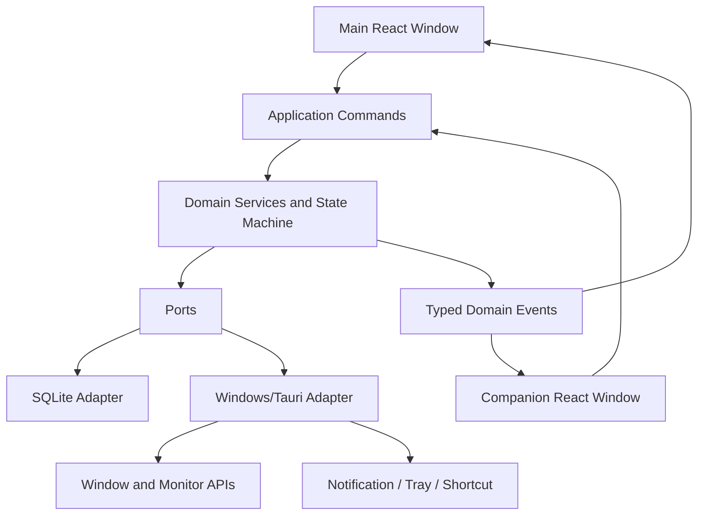

# System Architecture

## Style

- Frontend: feature-driven / feature-sliced hybrid.
- Core business rules: domain-oriented modules with explicit invariants.
- Desktop shell: Tauri 2.
- Persistence: local-first SQLite beginning in v0.1.0.
- Native integrations: adapters behind ports.
- Visual system: semantic React/CSS with approved raster 9-slice and sprite assets.



## Window model

### `main`

- 16:9 Roman campaign dashboard.
- Mission drafting, timer controls, summary metrics and later navigation.
- Custom undecorated title/header scaffold.

### `companion`

- Transparent always-on-top presentation.
- Minimal controls and character state.
- Must never own an independent authoritative session.

### Deferred

- `quick-command` window: v0.2.0 or later after workflow evidence.

## Ownership

- Rust/application layer owns authoritative active-session lifecycle by v0.1.0.
- React owns form drafts and transient presentation state.
- SQLite owns durable records.
- Visual assets are governed by `docs/assets/asset-registry.yaml`; only `approved` assets may ship as production art.
- Current Zustand persistence is a prototype bridge, not the final multi-window architecture.

## Visual architecture

```text
MainShell
├── CampaignBoard
├── FocusChamber
├── CompanionStage
└── CampaignSummary

Rendering
├── semantic HTML text and controls
├── CSS Grid layout
├── border-image 9-slice frames
├── repeatable texture tiles
└── CSS sprite-sheet animation
```

This separation allows art replacement without rewriting domain behavior.

## Security posture

- Minimal Tauri permissions and per-window capability review.
- No shell execution from webviews.
- No arbitrary filesystem scope.
- No remote content, scripts, fonts or production UI assets.
- Core validates IPC arguments.
- Every plugin/capability includes an ADR and threat review.
- Restrictive CSP is a v0.0.4 release gate before v0.1.0.
