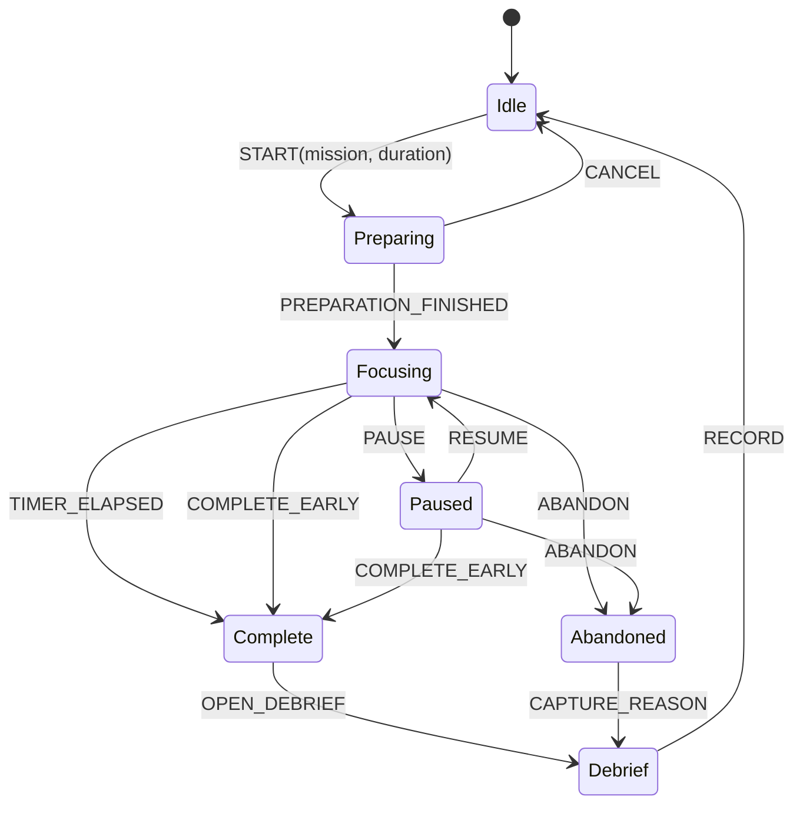

# Focus Session State Machine



## Timing model

Never use a decrement-only counter as source of truth.

```text
activeElapsed = now - startedAt - sum(pausedIntervals)
remaining = max(0, plannedDuration - activeElapsed)
```

## Recovery rules

- On restart, load active session and recompute from timestamps.
- If the system was sleeping, elapsed wall time counts as focus **by default**. Since v0.4.0 the watch notices a tick gap far larger than the tick interval and offers the user a choice: keep it as focus (the default — ignoring the offer changes nothing) or mark it as away, which accounts for the interval exactly like paused time. Detection alone never removes focus time.
- If stored state is invalid, preserve a recovery record and return to Idle rather than silently deleting it.

## Command idempotency

- START rejected unless Idle.
- PAUSE rejected unless Focusing.
- RESUME rejected unless Paused.
- COMPLETE produces one immutable record even if triggered twice.
