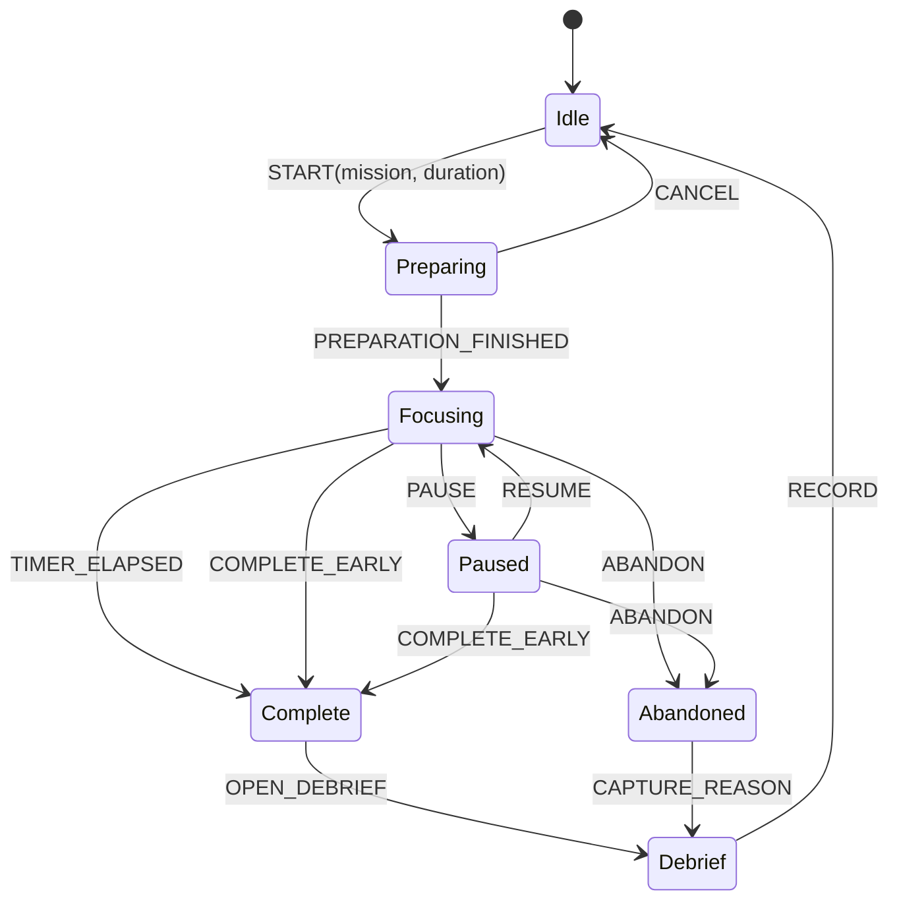

# Focus Session State Machine



## Timing model

Never use a decrement-only counter as source of truth.

```text
activeElapsed = now - startedAt - sum(pausedIntervals)
remaining = max(0, plannedDuration - activeElapsed)
```

## Recovery rules

- On restart, load active session and recompute from timestamps.
- If the system was sleeping, elapsed wall time counts as focus by default for v0.1.0; v0.2.0 may detect suspend/resume and ask the user to classify the interval.
- If stored state is invalid, preserve a recovery record and return to Idle rather than silently deleting it.

## Command idempotency

- START rejected unless Idle.
- PAUSE rejected unless Focusing.
- RESUME rejected unless Paused.
- COMPLETE produces one immutable record even if triggered twice.
