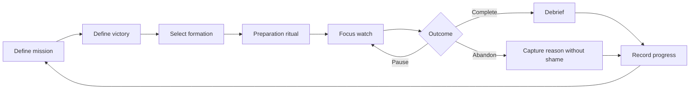

# Core Experience Loop

## Ritual timing

- Preparation animation: 600–1200 ms.
- State change feedback: immediate.
- Completion animation: maximum two seconds; it must not block access to results.
- Break prompts are introduced in v0.2.0.

## Content rules

Use concise, controlled language.

Preferred:

- “Define victory.”
- “Formation held for 42 minutes.”
- “The mission was interrupted. Reduce its scope or resume later.”

Forbidden:

- “You were weak.”
- “Real warriors never quit.”
- “You destroyed your streak.”
